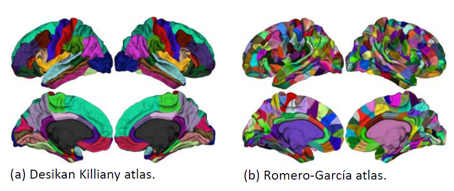
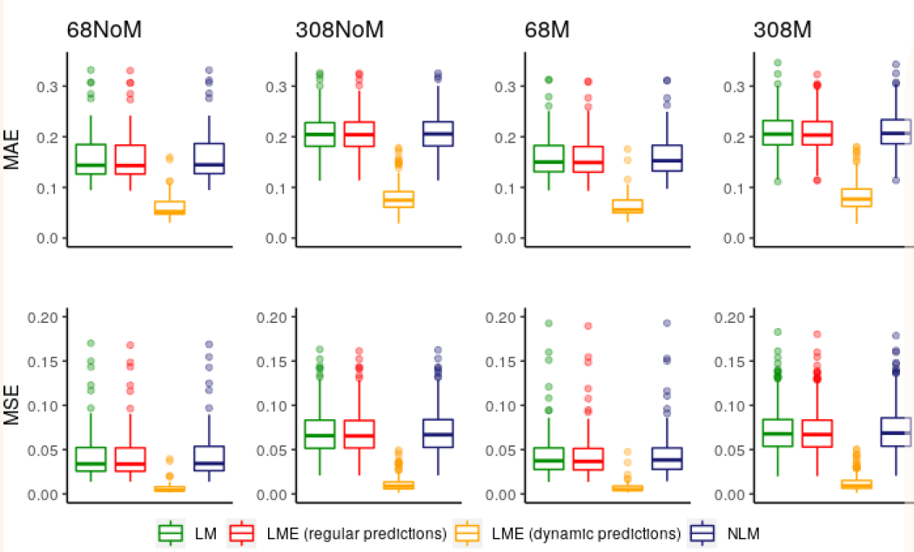
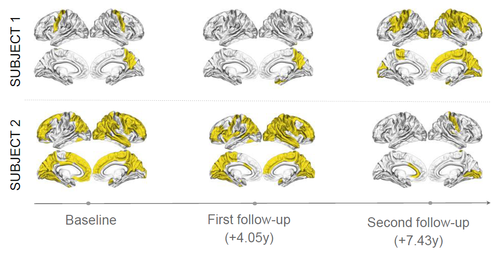
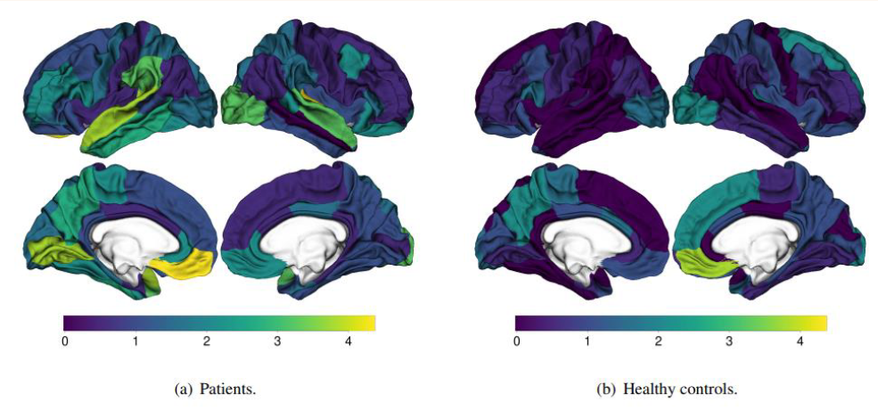
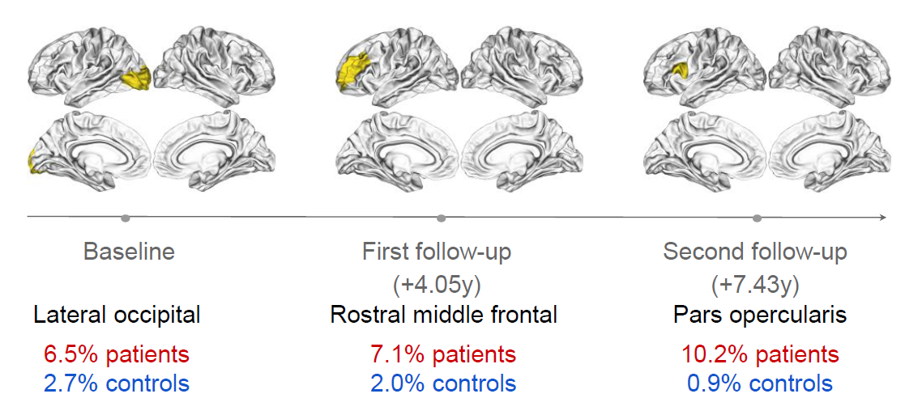

## Data

This project utilizes the Utrecht Schizophrenia Project database (293 healthy controls, 168 schizophrenia patients). -it is a longitudinal database (baseline, 4-year follow-up, sometimes second follow-up image at 7.5 years). The database comprises 1075 images processed using FreeSurfer, providing cortical thickness, brain volume, and Euler number data for 68 or 308 regions. Additionally, demographic variables including age, sex, diagnosis, IQ, and symptom presence are collected.

## Project structure
Inside the functions directory, there is a collection of 4 R scripts:

- 1_DataPreparation.R: functions for automating data preprocessing tasks to ensure data consistency and quality before analysis.
- 2_RegressionModel.R: functions for performing normative modeling and regression analysis on neuroimaging data, generating Z-scores and Cohen's d effect sizes for specified measures and regions of interest, and includes functions for model evaluation and correction for false discovery rate (FDR) in p-values.
- 3_Statistics.R: functions for computing statistics and generating density plots, histograms, boxplots, and mean z-scores of brain regions, saving the results as PNG files.
- 4_EDA.R: functions for performing exploratory data analysis (EDA) and variance partitioning using linear mixed-effects and fixed-effects models, generating violin plots for each data group and saving them as PNG files.

The remaining scripts are formatted in .Rmd files and leverage the functionalities provided by the aforementioned functions.

## Results

Various regression models are compared, using covariates such as age, sex, and Euler to predict cortical thickness in different brain regions. The performance of the models is evaluated in healthy subjects and patients using 10-fold cross-validation. The results are analyzed considering two spatial resolutions (68 and 308 regions) and before and after applying matching. It is found that the **LMEM longitudinal model with dynamic predictions** performs the best. Additionally, it is observed that models trained with **68 regions** outperform those trained with 308 regions, possibly due to the combination of a high-resolution atlas and a low-resolution scanner (1.5 T), which affects the accuracy of neurobiological measurements. Finally, it is decided to use the **post-matching dataset** due to its superior statistical performance for the study.

I calculated Z-scores for each participant per brain region and timepoint, comparing them against a critical value of 1.96 for a 95% confidence interval. Z-scores exceeding 1.96 indicate supra-deviated results, while those below -1.96 signify infra-deviated results. The figure illustrates two examples using the longitudinal mixed-effects normative model. Regions deviating from the norm are highlighted in yellow.

- Example 1: A patient progresses from relatively normal status to widespread deviation over time, suggesting cortical thickness loss.
- Example 2: Another patient transitions from generalized deviation to relatively normal status, possibly indicating a move towards normalization.

The figure illustrates the percentage of brain regions that deviate from the norm across different time points for patients and healthy controls. Patients show higher percentages of deviation compared to controls, albeit these are generally low.

The longitudinal MN approach assesses individuals with regions deviating from the model.

- At baseline, the lateral occipital region had the highest deviation in patients.
- At the first follow-up, the rostral middle frontal region showed the most deviation in patients.
- For the second follow-up, the pars opercularis region had over 10% of patients deviating, contrasting with less than 1% in controls.

